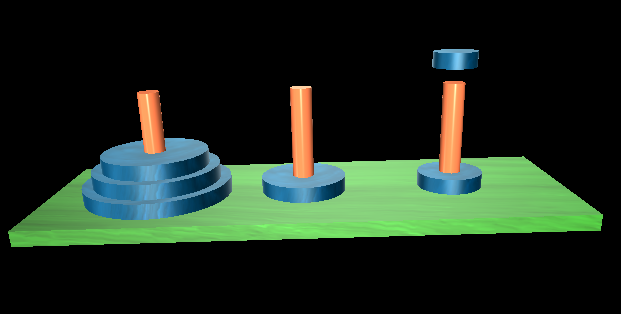

#Hanoi towers solution - visualized using Python

###Adi Levin, 9/January/2016

This Python module implements a classical recursive solution of the problem of Hanoi Towers, and visualizes it in 3D using the "visual" library.

##Dependencies

You'll need the [Visual](http://vpython.org/) package

##How to run

> python hanoi.py

##What you will see

You will see an animation of Hanoi Towers solution. Use your mouse + right button to rotate the display.

